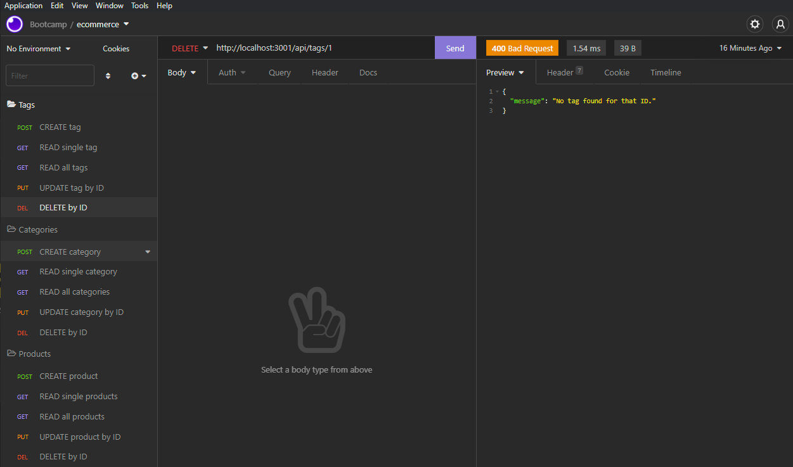

# E-Commerce Back End
	
## Description

This is a basic API structure for any e-commerce website. I t can handle modelling products, which belong to categories and are associated with tags. It is built on node.js and MySQL, and utilizes express.js for routing the sequelize ORM.

## Table of Contents

- [Installation](#installation)
- [Usage](#usage)
- [Questions](#questions)

## Installation

To install, clone the repository and set up a `.env` file in the project's directory. It should include the fields `DB_USER`, `DB_PW` and `DB_NAME`, set to your MySQL credentials and the database's name (ecommerce_db). To set up the database, run the `schema.sql` file found in the `db` directory. Optionally, the database can be seeded by running the `index.js` script in the `seeds` directory.

## Usage

To use the program, run the server by running the command `node server`, and make fetch requests as you see fit. For a video tutorial, click [here](https://youtu.be/HdP6vtkm5gk).

## Questions

I can be found on GitHub [here](https://github.com/CameronMSeibel).
If you have any questions, I can be reached at cam.m.seib@gmail.com

